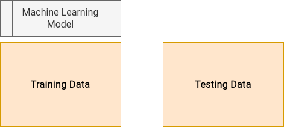

# Model Drift

¿What is the meaning of `model drift` in pydrift?

# Definition

Model drifting is all related to your features relation with your target drift, it checks when the relation between your features and the target you want to predict in a dataset are not aligned with other dataset ones.

The most common use case is when you train a model with a dataset, let's call it `df_train` and you want to apply your model to other dataset, for example `df_test`.

If the data you used for training your model has different patterns with your target that the ones in the data when you apply the model, then your model performance will be poor.

So model drift part of `pydrift` helps you to detect this changes that every feature has and understanding why your model is not working well.

Your model takes into account patterns and features distributions from the training data features.

For example if you train a model with data in which the variable 'A' has a positive correlation with the target but later in the data to which you apply it this correlation is negative, your model will not work well.

# Types of model drift

- Change in features relation or a very complex model (overfitting problem): `pydrift.ModelDriftChecker.check_model`
- Interaction between features drift (discriminative model): `pydrift.ModelDriftChecker.ml_model_can_discriminate`

# Change in features relation or a very complex model (overfitting problem)

This steps apply the model you have already trained to the test data and compute metrics for both datasets, if the performance in both datasets is not similar you have an overfitting problem, and can be simplified in just two reasons:

- Change in the relations between features and target
- You've trained a more complex model than it should be

# Interaction between features drift (discriminative model)

For a more general drift checking, `pydrift` trains a machine learning model (catboost by default, but you can use any model from `sklearn` API) creating a new target that indicates if a register comes from training distibution or from the testing one.

If the model can discriminate and obtains a good metric (AUC in this case) that means that your date is easily distinguishable, so you have a drift in your data.

If on the contrary the model is not able to differentiate between train and test data it means that you do not have any drift problem and that the data is not biased, so you will be able to apply your model without problems (waiting for the model drift checker step, that relies in your features relation with the correct target feature).
